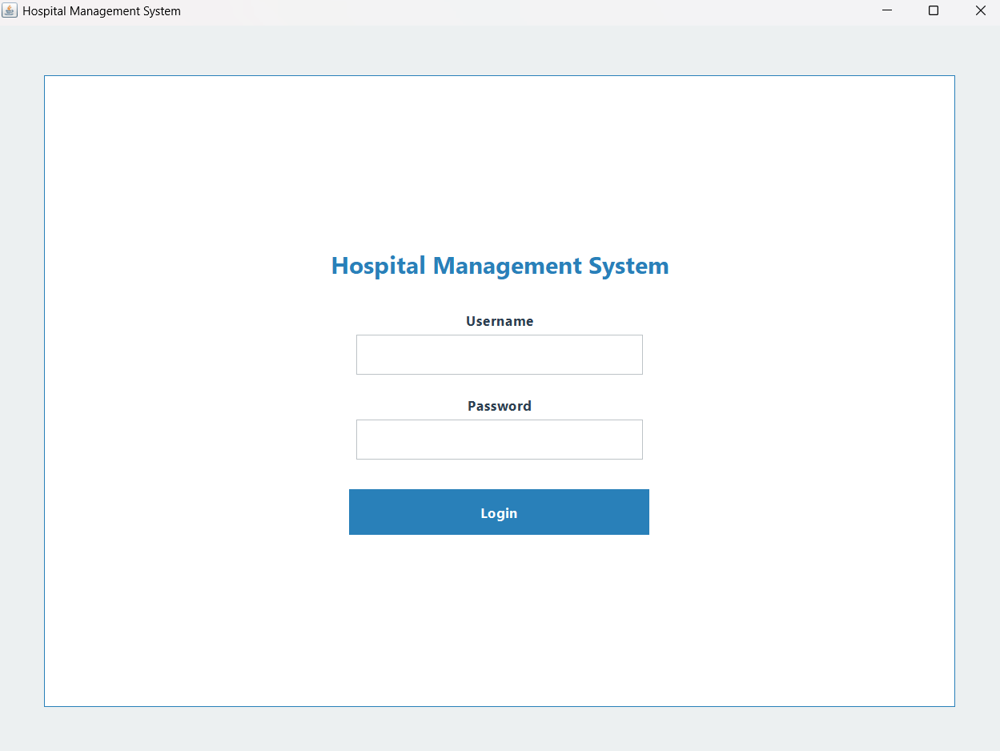
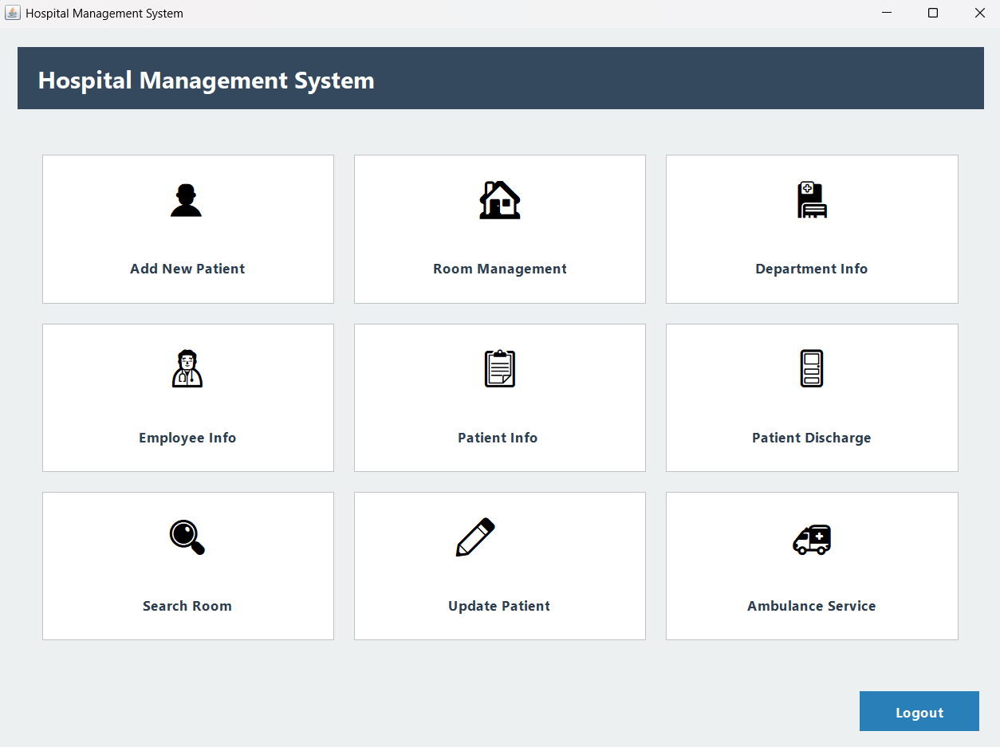
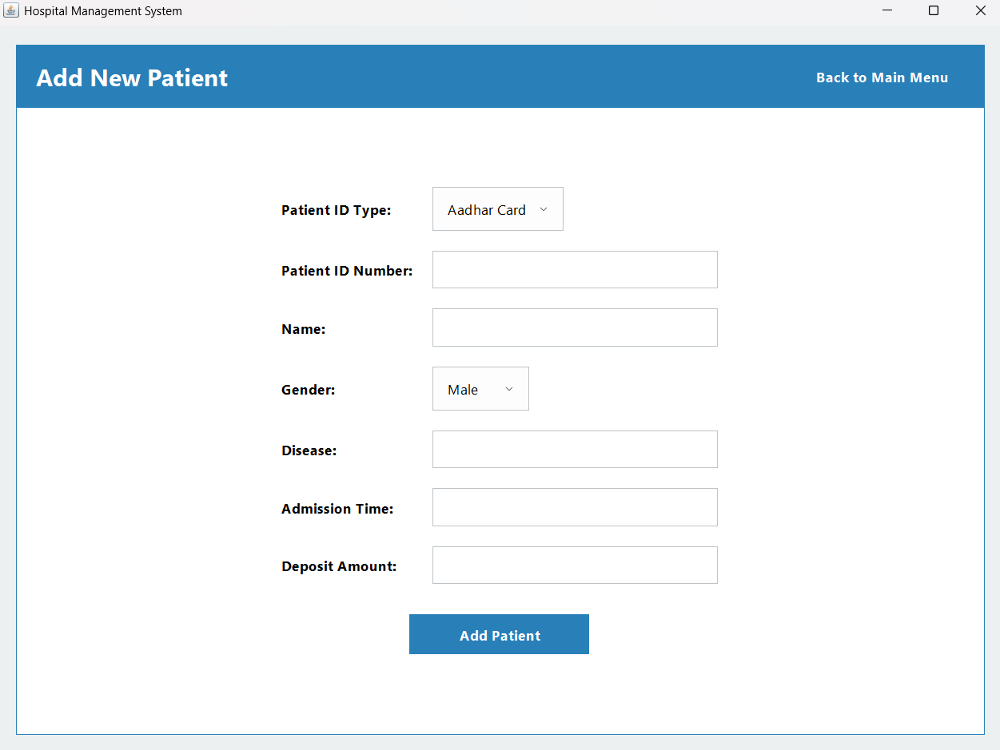
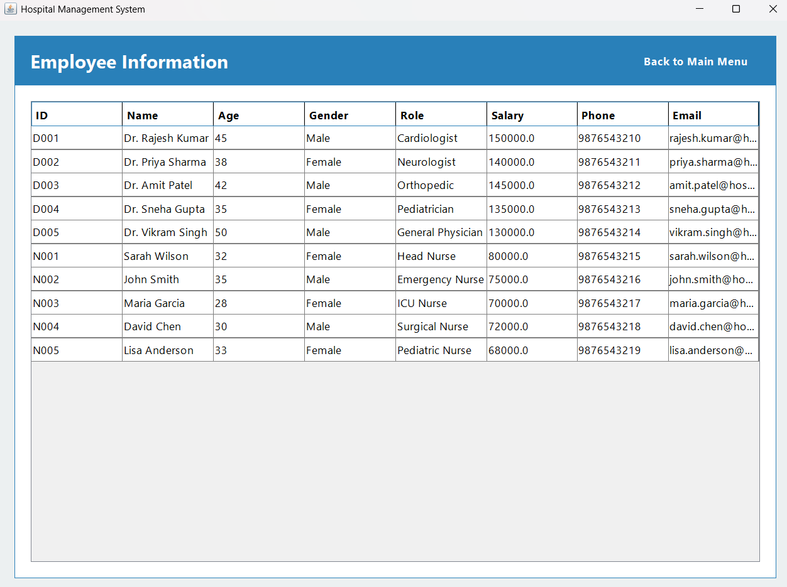
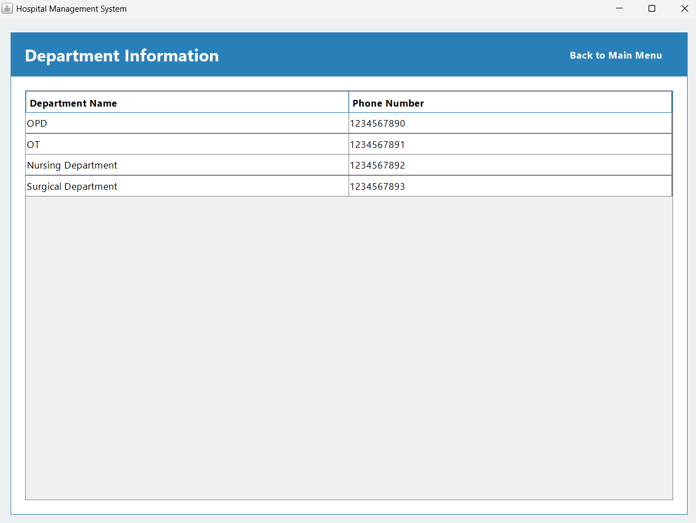
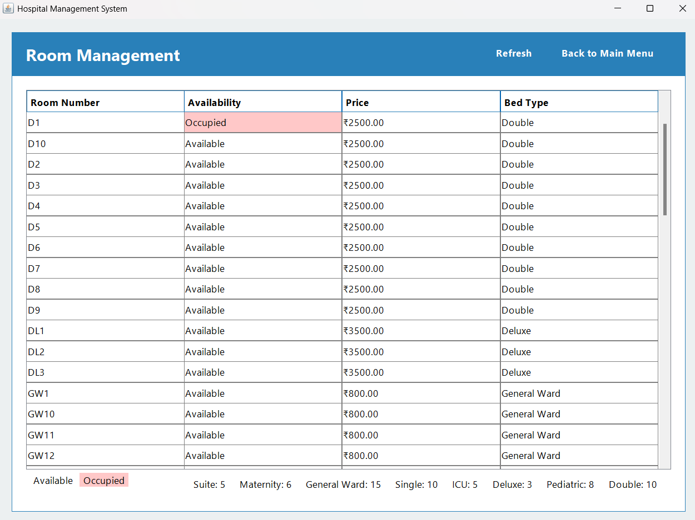
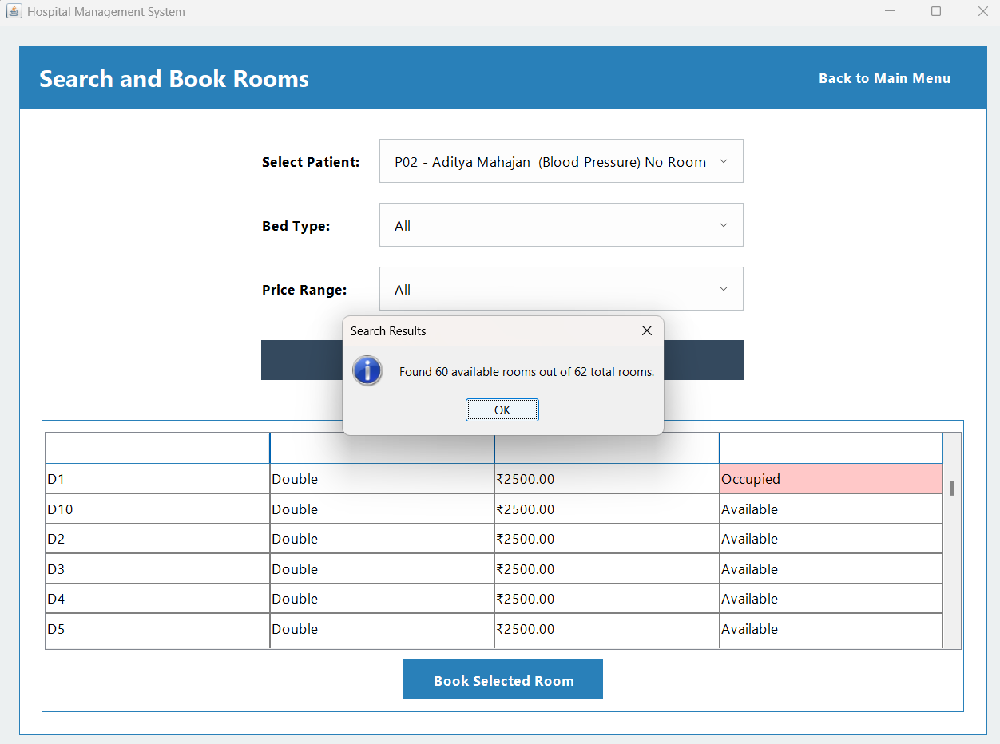
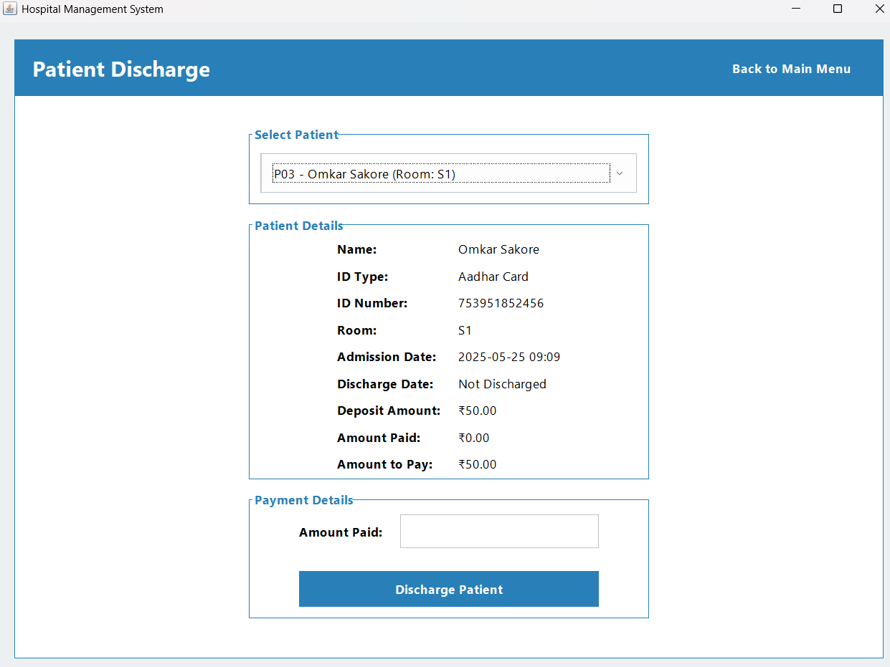
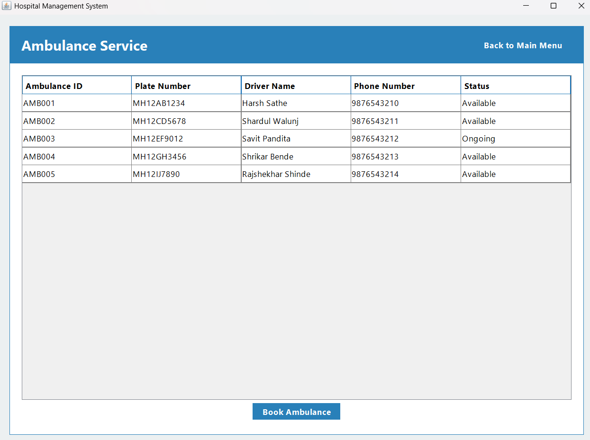

# Hospital Management System

A comprehensive desktop application built with Java Swing to manage patient information, appointments, staff, and other hospital resources. This project streamlines administrative tasks and improves data management efficiency for a small to medium-sized hospital or clinic.

---

## 🌟 Key Features

- **Patient Management:** Register new patients, view, and update existing patient records.
- **Staff Management:** Manage employee and doctor information, roles, and schedules.
- **Department & Room Management:** Track hospital departments and manage room availability, type, and pricing.
- **Appointment Scheduling:** Book and manage patient appointments with doctors.
- **Ambulance Service:** View and manage the status of the hospital's ambulance fleet.
- **Billing & Discharge:** Handle patient discharge processes and generate final billing.
- **Database Integration:** Securely stores all data in a MySQL database for persistence and reliability.

---

## 📸 Screenshots

Here is a gallery showcasing the application's key features and modules.

| Login Screen | Main Dashboard | Patient Registration |
| :---: | :---: | :---: |
|  |  |  |

| Patient Information | Employee Information | Department Information |
| :---: | :---: | :---: |
|  |  |  |

| Room Management | Search & Book Rooms | Patient Discharge |
| :---: | :---: | :---: |
|  |  |  |

| Ambulance Service |
| :---: |
|  |

---

## 🛠️ Technologies Used

- **Programming Language:** Java
- **UI Framework:** Java Swing
- **Database:** MySQL
- **JDBC Driver:** MySQL Connector/J

---

## 🚀 Getting Started

Follow these instructions to get a copy of the project up and running on your local machine.

### Prerequisites

You will need to have the following installed on your machine:
- Java Development Kit (JDK) 8 or higher
- An IDE like Eclipse, IntelliJ IDEA, or VS Code
- MySQL Server

### Installation

1.  **Clone the repository:**
    ```bash
    git clone [https://github.com/ShrikarBende/Hospital-Management-System.git](https://github.com/ShrikarBende/Hospital-Management-System.git)
    ```
2.  **Set up the database:**
    - Set up a local MySQL database.
    - Update the database connection details (URL, username, password) in the Java source code to match your database configuration.

3.  **Build and run the application:**
    - Open the project in your IDE.
    - Locate the main class (e.g., `HospitalManagementSystem.java`) and run the application.


---

## 📄 License

This project is licensed under the MIT License. See the `LICENSE` file for details.

